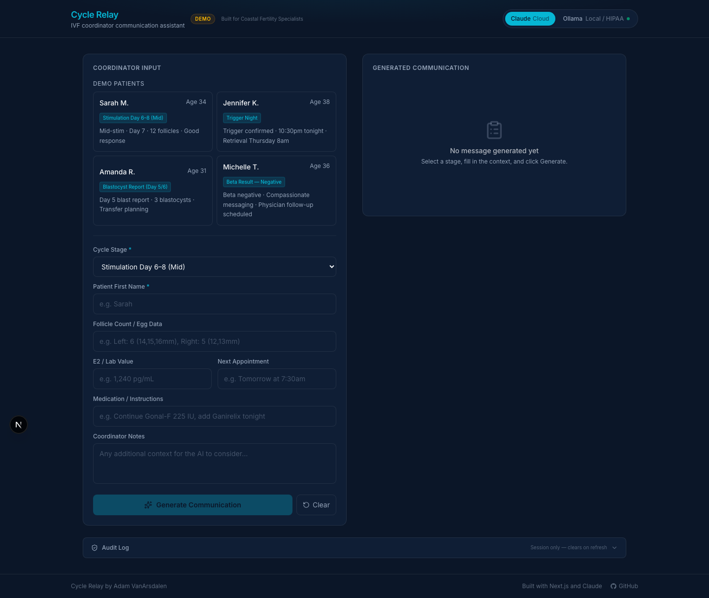
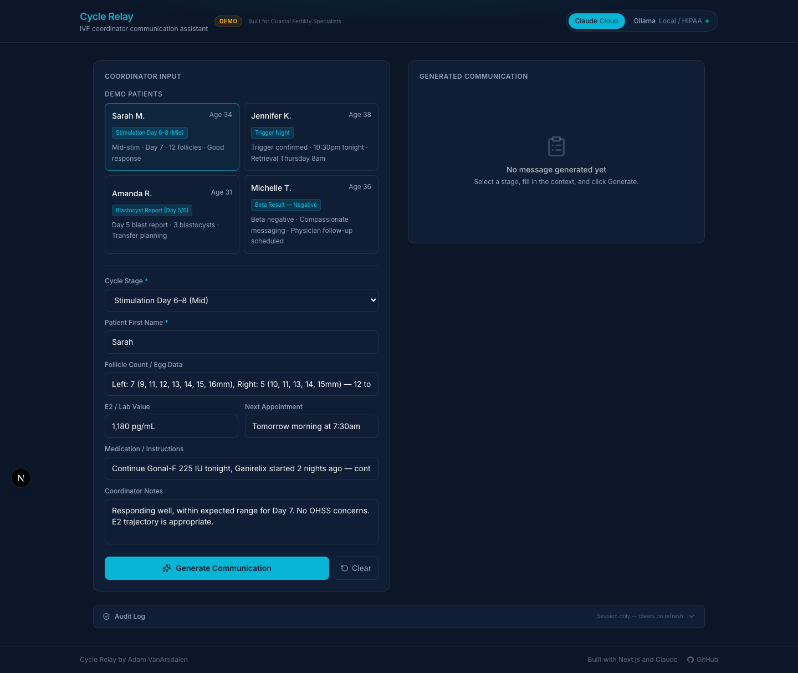
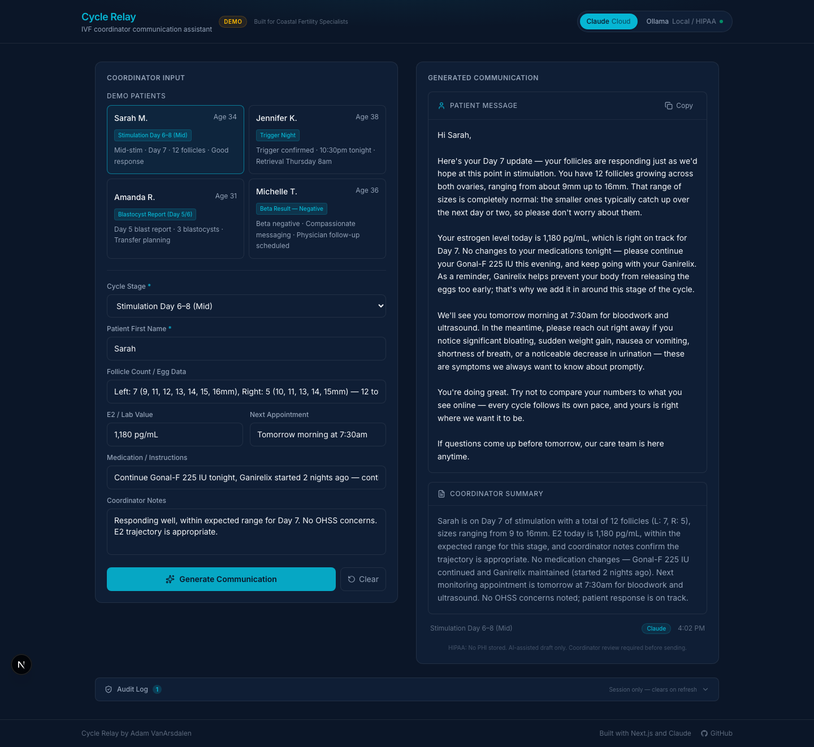
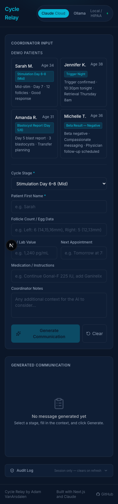

# Cycle Relay

**Live demo:** https://cycle-relay.vercel.app

Generates compassionate, stage-specific patient messages for IVF coordinators after Cycle Clarity delivers monitoring results to the physician, closing the communication gap between AI-powered follicle measurement and the human conversation that follows every monitoring appointment.

---

## Demo









See [`media/`](media/) for the full screenshot set and a demo video walkthrough.

---

## The Problem

[Cycle Clarity](https://cycleclarity.com) — founded by Dr. John Schnorr of Coastal Fertility Specialists — uses AI to perform 3D follicular ultrasounds in under a minute and automatically emails a standardized folliculogram to each patient. After that, the physician reviews the data and makes a dosing decision.

What happens next is entirely manual: a coordinator calls or messages each patient to communicate that decision. During peak monitoring, a coordinator might relay results to a dozen or more patients in a single afternoon — each conversation requiring the right clinical information, the right emotional tone, and stage-specific knowledge of what the patient is anxious about.

Cycle Relay generates the first draft of that conversation.

```
Cycle Clarity → follicle data to physician → automated report to patient
Physician reviews → makes dosing decision
[GAP] → Coordinator manually communicates decision to each patient
Cycle Relay → coordinator inputs clinical context → AI generates stage-aware message → coordinator reviews and sends
```

---

## What It Does

- **14 IVF cycle stages** covered: Day 3 baseline through trigger night, retrieval, fertilization report, blastocyst report, transfer day, two-week wait, and both beta outcomes
- **Stage-appropriate tone**: trigger night is urgent and precise; beta negative is grief-aware; mid-stim is grounding and informational
- **Three-part output**: patient-facing message, coordinator documentation summary, and clinical flags requiring physician review
- **Provider abstraction layer**: swap between Claude (cloud demo) and Ollama (local HIPAA deployment) via a single environment variable
- **Audit log**: session-only log of all generations with HIPAA policy tags; no PHI stored
- **Four synthetic demo profiles**: pre-loaded coordinator contexts for instant demonstration
- **Copy to clipboard** on patient messages

---

## Model Providers

### Cloud — Claude (Default)

The live Vercel demo uses **Claude Sonnet** via the Anthropic API. All API calls happen server-side via Next.js server actions — the API key never reaches the browser.

Set your key in `.env.local`:
```
ANTHROPIC_API_KEY=your_key_here
NEXT_PUBLIC_MODEL_PROVIDER=claude
```

### Local — Ollama (HIPAA Deployment)

For production clinical use, the Ollama provider keeps all patient data on the local network. No PHI ever leaves the clinic's infrastructure.

**Setup:**

1. Install Ollama: https://ollama.com/download

2. Pull a model:
   ```bash
   ollama pull llama3
   ```

3. Start Ollama (if not running as a service):
   ```bash
   ollama serve
   ```

4. Configure your `.env.local`:
   ```
   NEXT_PUBLIC_MODEL_PROVIDER=ollama
   NEXT_PUBLIC_OLLAMA_BASE_URL=http://localhost:11434
   NEXT_PUBLIC_OLLAMA_MODEL=llama3
   ```

5. Run the app locally — all generation stays on your machine.

**Note**: Switching from Claude to Ollama is a configuration change, not a code change. The provider abstraction layer (`lib/providers/`) handles both via a shared interface.

---

## Stack

| Layer | Technology |
|-------|-----------|
| Framework | Next.js 16 (App Router) |
| Language | TypeScript |
| Styling | Tailwind CSS |
| AI — Cloud | Anthropic Claude Sonnet (`@anthropic-ai/sdk`) |
| AI — Local | Ollama REST API |
| Deployment | Vercel |
| Font | Inter |

---

## Run Locally

```bash
git clone https://github.com/adam-vanarsdalen/cycle-relay
cd cycle-relay
npm install
cp .env.example .env.local
# Edit .env.local and add your ANTHROPIC_API_KEY
npm run dev
```

Open [http://localhost:3000](http://localhost:3000).

---

## Deploy to Vercel

1. Push the repo to GitHub
2. Import at [vercel.com/new](https://vercel.com/new)
3. Add environment variable in Vercel dashboard:
   - `ANTHROPIC_API_KEY` → your Anthropic API key
4. Deploy

The `vercel.json` at the project root configures the build automatically.

---

## Context

Built as a portfolio demonstration for **Coastal Fertility Specialists** in Mount Pleasant, SC — the clinic that both uses Cycle Clarity in clinical practice and was founded by its inventor, Dr. John Schnorr.

**All patient data in this demo is entirely synthetic.** The four demo profiles (Sarah M., Jennifer K., Amanda R., Michelle T.) are fictional personas created for demonstration purposes. No real patient names, ages, or clinical values are used anywhere in this application.

This project demonstrates how the coordinator communication workflow could be augmented by AI — not replaced. Every generated message is a draft that the coordinator reviews, edits if needed, and sends through the clinic's secure patient portal.

---

## Author

**Adam VanArsdalen**

- GitHub: [github.com/adam-vanarsdalen](https://github.com/adam-vanarsdalen)
- Project: [github.com/adam-vanarsdalen/cycle-relay](https://github.com/adam-vanarsdalen/cycle-relay)
